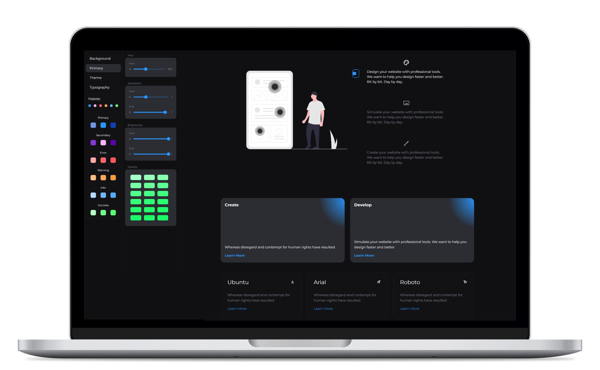
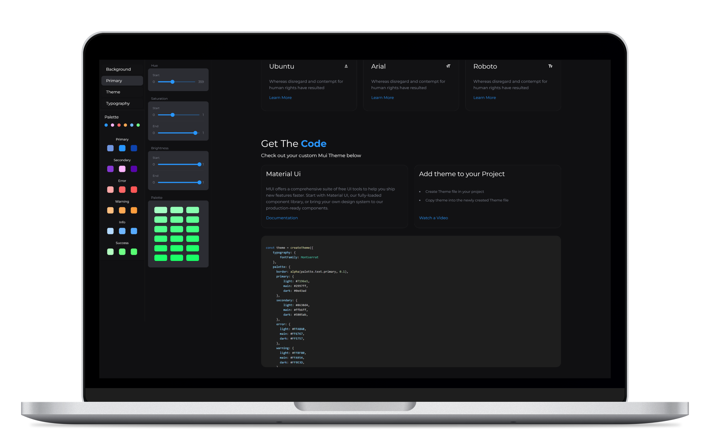
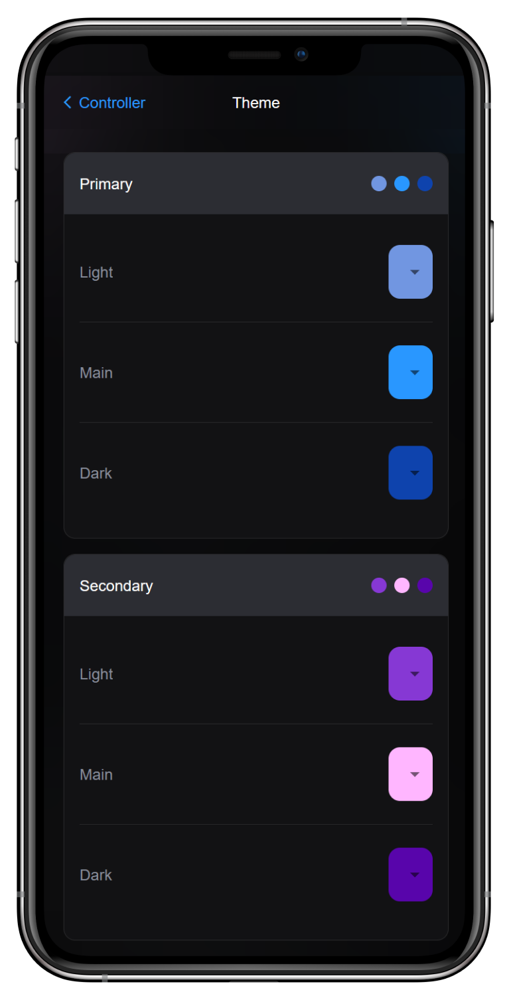
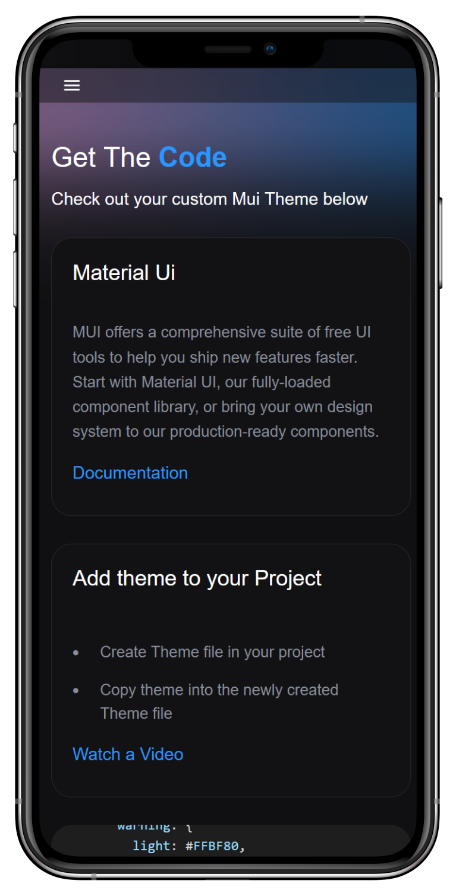

<!DOCTYPE html>
<html>

<body>
<h1>UiBuilder</h1>

<h2>Description</h2>

UiBuilder is a web application is as a hobby project built to help users design, customize, and simulate Material-UI themes. Leveraging the <a href="https://kvyn.medium.com/introducing-the-new-colorbox-e0109c021729">Colorbox Algorithm</a>, this platform is built on top of Material UI and provides a straightforward UI interface for customizing your theme. Once chosen a palette, users can copy the code into their MUI theme file 

<h2><a href="https://colors.stephengordon.ie/">Try it out</h2>

<h2>Screenshots</h2>

  
  

  
  

## How To Use

To get started with UiBuilder, follow these steps:

<ol>
	<li>Clone the repository to your local machine.</li>
	<li>Install the necessary dependencies using <code>npm install</code>.</li>
	<li>Start the application using <code>npm start</code>.</li>
</ol>

## Technologies / Frameworks
- React
- Material UI 
- [Colorbox](https://kvyn.medium.com/introducing-the-new-colorbox-e0109c021729)

## Connect With Me

- LinkedIn: [Stephen Gordon](https://www.linkedin.com/in/ste-gordon/)
- [Portfolio](https://www.stephengordon.ie)

</body>
</html>